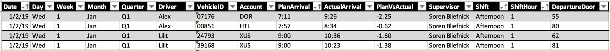
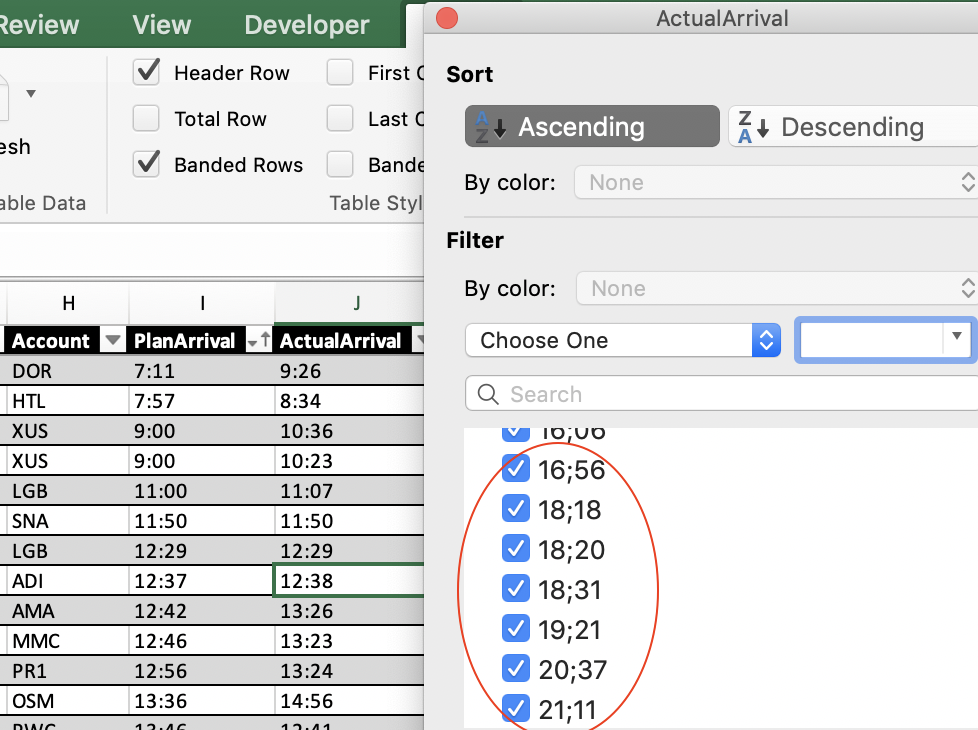

# Delivery Machine Learning

### Machine learning application based on delivery data for predictive analysis.

## Background

The CEO of our movie delivery company has tasked our development team with constructing a machine learning model to help predict if our deliveries will be on time. We have been receiving complaints from our customers that their movies have been arriving late and there have even been a number of customers who have canceled their subscriptions!  

E-commerce has seen tremendous growth this century. Companies like Amazon and Ebay have reaped the rewards of a market that seeks to connect products to consumers, translating digital interactions to purchases of physical products. As the industry grows, complementary industries are poised to benefit alongside it. The delivery industry, in particular, is an essential piece in connecting consumers and businesses. As consumers increasingly make purchasing decisions based on time to deliver, competitors in the delivery industry must fight for advantages in reducing that measurement. Knowing the variables that contribute to a delivery can help determine a model that aims to improve on the time to deliver measurement for a delivery company. Using package and Python 3.7 a machine learning model is developed to provide insight via a front end application for business intelligence users of the delivery company.

With all of this in mind, our development team has constructed a machine learning model, with the help of ETL techniques, to help make delivery predictions and better serve our customers. 

## Objective/Purpose

Using historical data collected from the first two quarters of the year,  use a machine learning model to predict if an upcoming delivery will arrive late or on time. This will enable our company to better serve our customers and thus, retain their business. By analyzing the historical data, we can focus in on each shifts performance, supervisor performce, and individual driver performance. 

## Hypothesis 

With a well trained machine learning model, and enough historical data, we can predict if a delivery will be on time. This includes customer location and distance. 

## Sources

* Keyed-in data from our employees in the Data Entry department.  
* Customer input when they sign up for our services.

## Procedures

### Data Collection
* Using functions in Microsoft Excel, organize historical data
* 
### Data Cleaning and Preprocessing 
* Use Microsoft Excel table filters to zero in on bad data 
* 
### Database Organization
* Filter data into categorical and calculable tables

## Technologies Used

* Microsoft Excel
* Python
* Pandas
* GeoPy
* SQLite3
* NumPy
* Statsmodels
* Dash
* SkLearn
* Matplotlib
* Seaborn
* Plotly
